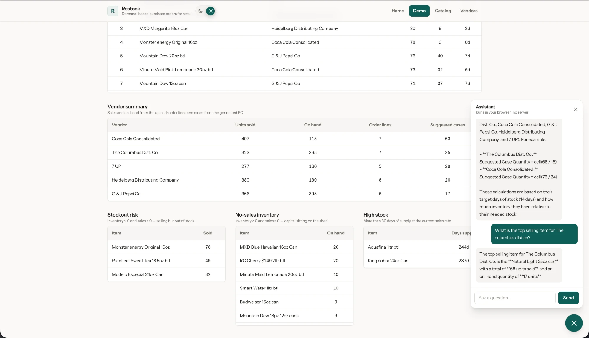

# Demo-Inventory-Dashboard — Interactive Purchase Order Demo

**[▶ Live demo](https://demo-inventory-dashboard.vercel.app/)**



A sanitized, interactive demo of a private retail operations platform that converts
point-of-sale **inventory and sales exports into vendor purchase orders**. Upload a
spreadsheet, get vendor-ready orders computed from real demand, review and adjust them,
and export a CSV — plus an analytics view that explains what's selling, what's at risk,
and what's overstocked. A built-in assistant answers questions about the catalog and the
current order from a language model that runs entirely in your browser — no server, no API key.

> ### ⚠️ Demonstration data
> Product and vendor names are real consumer brands, used only so the demo feels
> realistic. The **inventory levels, sales figures, scan-code mappings, and the generated
> purchase orders are all synthetic** — they do not represent any real store's data or any
> real vendor relationship. There is no database, no login, and no persistence. The real
> operational deployment this demo is modeled on remains private.

---

## Real-world context

A convenience store re-orders hundreds of SKUs from several vendors every week. The
manual workflow is a spreadsheet: for each supplier, compare recent sales against shelf
counts, item by item, and decide how many cases to buy. It's slow, easy to get wrong, and
has to be repeated constantly. The private tool this demo is based on replaces that grind:
it reads the POS inventory + sales export and proposes per-vendor case quantities using an
explainable formula, with an editable review step before the order is placed.

This public version keeps the exact engine and design but strips everything operational
(database, authentication, real catalog, OneDrive integration) and runs entirely in the
browser on synthetic data.

## Features

- **Synthetic sample workbook** — one-click download of a valid `.xlsx` that produces a full order.
- **In-browser upload & validation** — checks extension, 25 MB limit, required sheets, and required columns before any calculation.
- **Per-vendor purchase orders** — suggested case quantities from 14 days of sales minus on-hand stock, using each vendor's own settings.
- **Linked single → pack rollups** — sales (and fallback inventory) of a loose single roll into its orderable case.
- **Editable review** — adjust any line; Final Order and totals recompute live.
- **CSV export** — download the reviewed order for any vendor.
- **Analysis view** — headline metrics, a 14-day daily-sales trend, top sellers, vendor summary, and stockout / no-sales / high-stock lists.
- **In-browser AI assistant** — a chat widget that runs a language model client-side (WebGPU), grounded on the catalog, vendor rules, and the current run. No API key, no server, no per-query cost.
- **Searchable catalog & vendor pages.**
- **Stateless** — a page refresh resets everything.

## Technology stack

- **Next.js 16** (App Router, React 19) + **TypeScript**
- **Tailwind CSS v4** (light & dark themes, shared UI primitives in `app/globals.css`)
- **read-excel-file** — bounded, maintained Excel parser (browser build) for uploads
- **Node's built-in test runner** (`node --test`) for the engine and analytics
- **@mlc-ai/web-llm** — runs a quantized Qwen2.5-1.5B instruct model in-browser (WebGPU) for the assistant
- No database, no auth library, no charting library, no LLM API — the assistant model runs locally in the browser

## Architecture

```
                          Browser (everything runs here)
  ┌─────────────────────────────────────────────────────────────────────┐
  │                                                                       │
  │   sample-inventory.xlsx ──download──►  user                          │
  │                                          │ uploads .xlsx              │
  │                                          ▼                            │
  │   lib/engine.mjs                                                      │
  │     parseFile(file) ──► read-excel-file (in-memory, never persisted)  │
  │        │  validate sheets + columns                                   │
  │        ▼                                                              │
  │     aggregate() ──► { inventory, 14-day sales, daily totals }         │
  │        │                                                              │
  │        ├─ computeLines(fixtures, inv, sales) ──► per-vendor PO lines  │
  │        │     uses lib/fixtures.mjs (catalog, vendor settings, links)  │
  │        │                                                              │
  │        └─ analyze(...) ──► metrics, trend, top sellers, risk lists    │
  │                                                                       │
  │   React state (useState)  ◄── live adjustments, CSV export            │
  │     refresh ⇒ state gone ⇒ demo resets                               │
  └─────────────────────────────────────────────────────────────────────┘

  No server routes · No database · No authentication · No persistence · LLM runs in-browser
```

## The purchase-order formula

For each orderable catalog item, using **per-vendor** `targetDays`, `inventoryCredit`,
and `salesWindowDays`:

```
dailyRate    = salesUsed / salesWindowDays
needed       = dailyRate * targetDays  −  inventoryCredit * max(0, inventory)
suggestedCases = needed > 0 ? ceil(needed / caseQty) : 0
```

Guards: no order if `salesUsed < 1`, if `caseQty` is missing/zero, or if `needed ≤ 0`.

- **`targetDays`** — how many days of stock to carry (bigger ⇒ bigger orders).
- **`inventoryCredit`** — how much on-hand stock counts against the order (0–1).
- **`salesWindowDays`** — the look-back window for demand (14 days here).

### Linked single → pack

Some items are sold as a loose **single** but ordered only as a **pack/case**. A linked
single (`allow_order = false`) contributes to its orderable pack:

- **Sales always roll in:** `salesUsed(pack) += sales(single) / conversionRatio`.
- **Inventory is a fallback:** if the pack has positive direct inventory, that's used;
  otherwise `inventory(pack) = Σ inventory(single) / conversionRatio`.

`conversionRatio` is how many singles equal one orderable unit (e.g. a 24-can case ⇒ 24).

## Data-analysis definitions

All explainable arithmetic over the uploaded window — **the metrics themselves use no AI or
machine learning**. The in-browser assistant only reads these computed values; it never produces them.

| Metric | Definition |
|--------|-----------|
| Units sold (14d) | Sum of all sales within the 14-day window. |
| Current inventory units | Sum of the latest on-hand quantity per scan. |
| Suggested cases | Sum of `suggestedCases` across the generated order. |
| Vendors needing an order | Distinct vendors with at least one order line. |
| Stockout-risk items | Inventory ≤ 0 **and** sales > 0 (selling but out of stock). |
| No-sales inventory | Inventory > 0 **and** sales = 0 (capital on the shelf). |
| Days of supply | `inventory / (sales / 14)` when sales > 0. |
| High stock | Days of supply > 30. |
| Daily sales trend | Units sold per day across the 14-day window (zero days included). |
| Top 10 fastest-selling | Items ranked by units sold, descending. |
| Vendor summary | Per vendor: units sold, on-hand, order lines, suggested cases. |

## In-browser assistant

A chat assistant (bottom-right on every page) answers natural-language questions about the
catalog, vendor rules, and the current uploaded run — *"Which vendors are there?"*,
*"What's at risk of stocking out?"*. It runs a quantized **Qwen2.5-1.5B** instruct model
**entirely in the browser** via WebGPU (`@mlc-ai/web-llm`): the weights download once and
cache locally, so there is **no API key, no server, and no per-query cost**.

The model is **grounded** on the same pre-computed catalog and analysis data the rest of the
app uses, and is told to answer only from it. The deterministic engine owns every number; the
assistant reads and explains it and never recalculates — so it cannot fabricate an order
quantity. Requires a WebGPU browser (Chrome or Edge on desktop).

## Privacy & security decisions

- **Uploads stay in memory.** The workbook is parsed client-side with `read-excel-file`;
  bytes are never sent to a server, written to disk, logged, or stored in `localStorage`.
- **No database, no auth, no persistence.** There is nothing to leak and nothing to breach.
- **Malformed input is rejected before any calculation** — wrong extension, oversize file,
  missing sheets, or missing required columns all produce a clear error.
- **Parser choice.** Uploads use the small, maintained `read-excel-file`, which never
  executes untrusted input.
- **Synthetic data only.** The bundled catalog, vendors, scan codes, inventory, and sales
  are fictional.

## Local setup

```bash
npm install
npm run dev        # http://localhost:3000
```

## Testing

```bash
npm test           # node --test: PO formula, linked rollups, required columns, date handling, analytics
npm run lint
npm run build
```

## Public demo

🔗 **Live demo: https://demo-inventory-dashboard.vercel.app/**

---

The real operational deployment — database-backed, authenticated, and integrated with the
store's POS exports — **remains private**. This repository is a portfolio demo.
